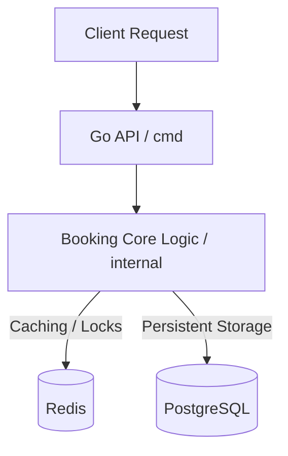

# Concurrent Seat Booking System (Stampede)

A highly concurrent seat booking system built with Go, Redis, and PostgreSQL.

## Architecture

The system is designed to handle a high volume of concurrent booking requests while ensuring data consistency and preventing double-booking.

## Tech Stack
- **Language**: Go
- **Database**: PostgreSQL
- **Cache & Concurrency Control**: Redis
- **Containerization**: Docker & Docker Compose

## Quick Start
1. Ensure you have Docker and Docker Compose installed.
2. Run `docker-compose up -d` to start the PostgreSQL database, Redis, Redis Commander, and run database migrations.
3. Run the Go application (e.g., `go run cmd/main.go`).

## Documentation
Further architecture concepts and detailed documentation can be found in the [`docs/`](./docs) directory.