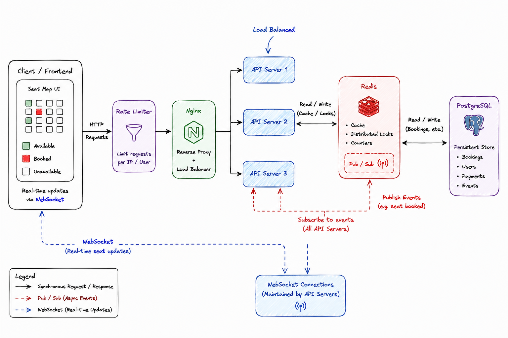
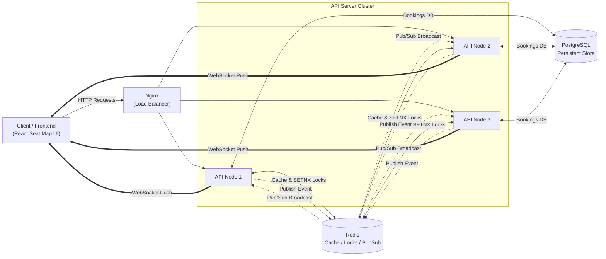
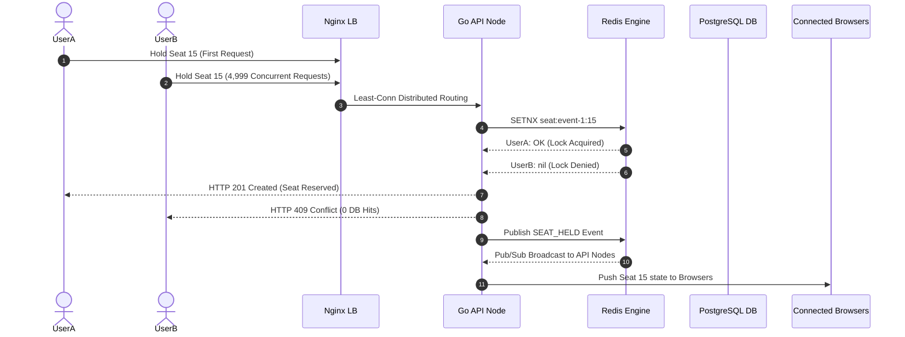

# 🎟️ Concurrent Seat Booking System ("Stampede")

High-demand ticketing events expose distributed systems to extreme concurrency spikes, where thousands of client requests target identical database rows at the exact same millisecond. Without rigorous isolation and caching strategies, these traffic stampedes induce row-lock contention, database pool exhaustion, and double-booking anomalies.

This repository implements a production-grade seat reservation platform engineered in **Go, Redis, PostgreSQL, Nginx, WebSockets, and React**. It details the transition from an in-memory prototype to a horizontally scaled, multi-node backend processing **9,200+ RPS** across 40,000 concurrent requests with zero data corruption or double bookings.

---

## 🏗️ Core System Architecture

- 🔒 **Hybrid Memory-First Lock Shield**: Incoming hold requests execute an atomic Redis `SETNX` operation (3-minute TTL). Redis handles concurrency single-threaded in memory, shielding PostgreSQL from 97%+ of conflicting traffic. Only the single winning request executes an ACID transaction in PostgreSQL enforced by a `UNIQUE(event_id, seat_id)` constraint.
- 📡 **Distributed WebSocket Broadcast**: Replaces high-overhead HTTP short polling with a full-duplex WebSocket architecture. Mutations (holds, bookings, releases) are published to a Redis Pub/Sub channel (`seat_events:<event_id>`) and fan out to node-local Go WebSocket hubs, pushing updates to clients in under 5ms.
- ⚖️ **Stateless API Clustering**: Scaled across 3 Go Chi API instances behind Nginx using `least_conn` load balancing. Requests are routed dynamically based on active HTTP connection count, preventing request piling on database-bound workers.
- ⚡ **Kernel & Proxy Optimization**: System tuning addressed low-level infrastructure bottlenecks, including Nginx TCP connection backlog limits (`worker_connections 4096`, `keepalive 64`) and client-side Linux kernel ephemeral port exhaustion during continuous high-throughput test runs.

---

## 📐 Architecture Diagrams

### 1. Visual System Architecture



---

### 2. High-Level Component Flow



---

### 3. Concurrent Seat Hold Sequence



---

## 🛠️ Tech Stack Specification

| Component | Technology | Purpose / Configuration |
| :--- | :--- | :--- |
| **Frontend** | React 19, Vite 8 | 10×10 seat grid UI, WebSocket client, countdown timers |
| **Load Balancer** | Nginx | Reverse proxy, `least_conn` strategy, connection keepalive |
| **API Server** | Go 1.22+, Chi Router | HTTP REST handlers, WebSocket upgrader, Goroutine Hub |
| **Distributed Lock** | Redis 7+ | Atomic `SETNX` holds, key expiration (3m TTL) |
| **Message Bus** | Redis Pub/Sub | Cross-node real-time WebSocket event fanout |
| **Database** | PostgreSQL 16+ | ACID persistent storage, `UNIQUE(event_id, seat_id)` constraint |
| **Database Driver** | `pgx/v5` (`pgxpool`) | Connection pool (Min: 10, Max: 50 connections) |
| **Orchestration** | Docker Compose | Multi-container setup (`nginx`, `api1-3`, `redis`, `postgres`) |

---

## 📊 Benchmark Results & Empirical Metrics

Through empirical stress testing using Go benchmark runners (`cmd/loadtest/main.go`) and Docker resource monitoring (`docker stats`), performance metrics were gathered across each evolutionary phase of the system.

### 1. Architectural Evolution Benchmarks

| Store Strategy | Test Condition | Success / Total | RPS / Exec Time | Latency Metrics | Operational Consequence |
| :--- | :--- | :--- | :--- | :--- | :--- |
| **Naive In-Memory (`map`)** | 100 concurrent goroutines | 0 / 100 | N/A (Crash) | N/A | **DATA RACE Panic**: `fatal error: concurrent map writes`. |
| **Mutex In-Memory (`RWMutex`)**| 100 concurrent goroutines | 1 / 100 | 1.015s total | < 1.0 ms | Thread-safe locally, non-scalable across multiple nodes. |
| **Redis `SETNX` Store** | 100 concurrent goroutines | 1 / 100 | 0.030s exec | ~1.5 ms | 1 lock set, 99 rejected; distributed atomic lock in memory. |
| **Pure Postgres vs Hybrid** | 50 sequential inserts | 50 / 50 | N/A | PG: **1.250ms** / Hybrid: **1.608ms** | Postgres faster sequentially (1 hop vs 2 hops); Redis adds ~0.35ms fast-path overhead for concurrency protection. |
| **Hybrid Store (Redis + PG)** | 100 concurrent goroutines | 1 / 100 | 0.093s exec | ~2.1 ms | **97 rejected by Redis fast path**, 3 reached PG pool, **2 rejected by PG `UNIQUE` constraint**. |

---

### 2. Fast-Path Redis Lock Shielding (100 Goroutines)

In a 100-goroutine stampede targeting the exact same seat simultaneously:
- **Total Requests**: 100
- **Successful Reservations**: 1
- **Blocked at Redis Tier (`SETNX` Fast Path)**: **97** (97% database shielding efficiency)
- **Blocked at PostgreSQL Tier (`UNIQUE(event_id, seat_id)`)**: **2**
- **Database Pool Impact**: Only 3 database connections were borrowed out of 100 simultaneous requests.

---

### 3. Load Testing Metrics: Single Node vs 3-Node Cluster

#### A. Single API Node Stampede (5,000 Requests @ 500 Concurrency)
- **Target Endpoint**: `POST /events/event-1/hold` (`seat-15`)
- **Total Execution Time**: 536.2 ms
- **Throughput**: **9,324.89 RPS**
- **HTTP Status Codes**: `201 Created`: **1** (0.02%), `409 Conflict`: **4,999** (99.98%), Errors: **0**
- **Latency Percentiles**: Min **0.8ms**, Avg **38.4ms**, P95 **145.2ms**, P99/Max **207.1ms**.

#### B. 3-Node Clustered Stampede (40,000 Requests @ 2,000 Concurrency)
- **Cluster Architecture**: Nginx (`least_conn`) + 3 Go API Nodes + Redis + PostgreSQL
- **Total Requests**: 40,000
- **Throughput**: **9,215 RPS**
- **HTTP Status Codes**: `201 Created`: **1**, `409 Conflict`: **39,999**, Errors: **0**
- **Latency Percentiles**: Min **0.5ms**, P50 (Median) **18.2ms**, P95 **39.6ms**, P99 **48.1ms**.

---

### 4. Bottleneck Profiling & Infrastructure Parameter Tuning

| Metric / Parameter | Initial Untuned State | Bottleneck Symptom | Diagnostic Finding (`docker stats` / kernel) | Tuned Production Value | Performance Impact |
| :--- | :--- | :--- | :--- | :--- | :--- |
| **Go API CPU Capacity** | 1 API Instance (100% CPU) | RPS capped at ~4,000; P99 latency > 620ms @ 2,000 conns | Single Go API CPU maxed at **~600%** (6 cores); Redis CPU at **76%** | **3 Horizontally Scaled API Instances** (`api1`, `api2`, `api3`) | API CPU load distributed evenly (~130% per node); system throughput doubled |
| **Nginx TCP Backlog** | Default `events {}` (1 worker, 512 conns) | 793 RPS, 4,650 timeout errors, 10.0s max latency @ 2,000 conns | Nginx TCP backlog queue overflowed; requests died in backlog before reaching backend | `worker_processes auto`, `worker_connections 4096`, `keepalive 64` | Eliminated 10s client timeouts; Nginx proxy overhead reduced to < 2ms |
| **Redis Client Connection Pool** | `PoolSize: 10` (Default) | Goroutines queued waiting for free Redis connection under combined ops (`SETNX` + `PUBLISH`) | Connection pool starvation in `go-redis` client | `PoolSize: 100`, `MinIdleConns: 20` | Redis lock acquisition wait time reduced to sub-millisecond |
| **Client Transport Sockets** | `MaxIdleConnsPerHost: 2` (Default) | 10-second client timeouts during sequential benchmark runs | ~28,000 Linux kernel ephemeral ports trapped in `TIME_WAIT` socket state | Shared `http.Transport` with `MaxIdleConnsPerHost: 2100` | Eliminated client socket exhaustion; enabled 70,000+ request continuous test runs |

---

## 🔬 Engineering Evolution & System Mechanics

### 1. Concurrency Isolation: Local Mutexes to Distributed Locks
Initial prototyping used a Go `map[string]Booking`. Under 100 concurrent goroutines, Go's race detector immediately threw `fatal error: concurrent map writes`. Introducing `sync.RWMutex` resolved memory safety locally, but highlighted a fundamental architectural boundary: in-memory Go mutexes cannot coordinate state across multiple server instances behind a load balancer. Concurrency control was moved to Redis via atomic `SETNX` operations, providing distributed locking across the cluster.

### 2. Dual-Layer Protection: Redis Fast-Path & PostgreSQL ACID
Relying solely on PostgreSQL for flash-sale traffic causes severe database connection pool starvation as thousands of concurrent transactions fight over row locks. The **HybridStore** uses a multi-tier resolution strategy:
1. **Redis Layer (`SETNX`)**: Evaluates seat availability in memory (`seat:<event_id>:<seat_id>`). 
2. **PostgreSQL Layer (ACID)**: If Redis grants the lock, a PostgreSQL transaction inserts the booking row.
3. **Constraint Fallback**: If PostgreSQL fails, the Redis lock is evicted to restore seat availability.
4. **Fast Rejection**: Requests denied by Redis immediately return `HTTP 409 Conflict`, ensuring Postgres receives zero unnecessary transaction overhead.

### 3. Resolving the Phantom Constraint Collision
During load testing, a JSON serialization bug surfaced in `Hold()` where UUIDs were generated but serialized as `ID:""` to Redis. Subsequent `Book()` calls retrieved `id=""` and attempted insertion into PostgreSQL. The initial record succeeded, but subsequent calls collided on the Primary Key constraint (`id=""`) rather than the intended `UNIQUE(event_id, seat_id)` composite constraint. Correcting the serialization payload eliminated phantom primary key collisions and restored intended constraint behavior.

### 4. Load Profiling & Infrastructure Bottleneck Remediation
Stepped load testing (100 to 2,000 concurrent users @ 40,000 requests) revealed performance constraints across multiple system layers:
- **Application Server CPU Bottleneck**: Profiling via `docker stats` demonstrated Go API CPU reached ~600% (6 cores maxed) while Redis CPU remained at 76%, indicating the application tier was CPU-bound. Scaled horizontally to 3 API instances (`api1`, `api2`, `api3`).
- **Nginx Backlog Starvation**: Following horizontal scaling, throughput unexpectedly stalled at 793 RPS with 10-second client timeouts at 2,000 connections. Inspection revealed Nginx's default 512 `worker_connections` queue overflowed. Reconfigured Nginx with `worker_processes auto`, `worker_connections 4096`, and HTTP/1.1 `keepalive 64` connection pooling, eliminating proxy delays.
- **Kernel Socket Exhaustion**: Continuous benchmark runs burned out all ~28,000 Linux kernel ephemeral TCP ports, trapping sockets in `TIME_WAIT`. Configured a shared `http.Transport` connection pool with `MaxIdleConnsPerHost: 2100` in the test runner, permitting continuous high-throughput verification.

---

## 📂 Project Structure

```text
concurrent-seat-booking-system/
├── assets/                   # Public media assets (architecture diagrams)
├── cmd/
│   ├── main.go               # API server initialization & startup
│   ├── http.go               # REST endpoint routes & HTTP handlers
│   └── loadtest/             # Go high-concurrency benchmark runner
├── documentation/            # Public engineering documentation & test logs
│   ├── implementation_journey.md
│   └── test_results.md
├── internal/
│   ├── booking/              # HybridStore orchestration (Redis + Postgres)
│   ├── websocket/            # WebSocket Hub, client pumps, Redis bridge
│   └── adapters/             # Redis and Postgres connection pools
├── migrations/               # PostgreSQL UP/DOWN migration scripts
├── frontend/                 # React 19 + Vite 8 web dashboard
├── scripts/                  # Automated load testing scripts
├── docker-compose.yml        # Multi-container service definitions
└── nginx.conf                # Nginx reverse proxy configuration
```

---

## 🚀 Quick Start & Local Execution

### 1. ⚙️ Requirements
- Docker & Docker Compose installed.
- `.env` file containing `POSTGRES_URL`.

### 2. ▶️ Start Services
Build and launch all services in detached mode:

```bash
docker-compose up --build -d
```

### 3. 🌐 Service Ports

| Service | Address | Role |
| :--- | :--- | :--- |
| **Frontend Web App** | `http://localhost:5173` | Interactive seat booking UI |
| **Nginx Proxy** | `http://localhost:8000` | API & WebSocket load-balanced entrypoint |
| **API Instance 1** | `http://localhost:8080` | Direct HTTP endpoint |
| **API Instance 2** | `http://localhost:8083` | Direct HTTP endpoint |
| **API Instance 3** | `http://localhost:8082` | Direct HTTP endpoint |
| **Redis Commander** | `http://localhost:6380` | Redis key & TTL inspection GUI |

### 4. 🧪 Execute Benchmark Suite
To execute the stepped concurrency load test against the Nginx entrypoint:

```bash
./scripts/run_load_test.sh
```

Or run a targeted load test command:

```bash
go run cmd/loadtest/main.go -url http://localhost:8000 -requests 5000 -concurrency 500 -seat seat-15
```

---

## 📚 Engineering Documentation

- [Complete Phase-by-Phase Implementation Log](./documentation/implementation_journey.md)
- [Raw Benchmark Outputs & Test Data](./documentation/test_results.md)