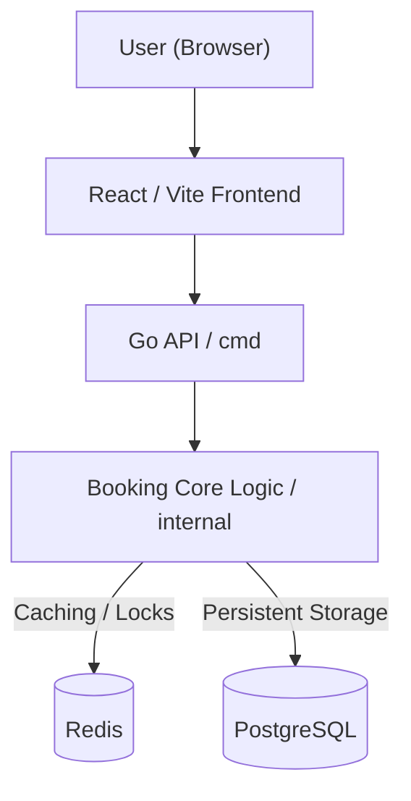

# Concurrent Seat Booking System

A highly concurrent seat booking system built with Go, Redis, PostgreSQL, and a React frontend. The system is designed as a high-demand ticketing platform.

## Architecture

The system is designed to handle a high volume of concurrent booking requests while ensuring data consistency and preventing double-booking using a distributed lock and hold mechanism.

## Tech Stack
- **Frontend**: React, Vite
- **Backend API**: Go
- **Database**: PostgreSQL
- **Cache & Concurrency Control**: Redis
- **Containerization**: Docker & Docker Compose

## Quick Start
1. Ensure you have Docker and Docker Compose installed.
2. Run `docker-compose up --build -d` to start the PostgreSQL database, Redis, Redis Commander, run database migrations, build the Go API, and serve the React frontend.
3. Access the services:
   - **Frontend UI**: [http://localhost:5173](http://localhost:5173)
   - **Backend API**: [http://localhost:8080](http://localhost:8080)
   - **Redis Commander** (GUI for Redis): [http://localhost:8081](http://localhost:8081)

## Documentation
Further architecture concepts and detailed documentation can be found in the [`docs/`](./docs) directory and the `implementation_journey.md`.